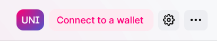

# 🦄 How To Purchase $FWB

This guide explains how to purchase $FWB token. You must hold $FWB cryptocurrency tokens to join Friends With Benefits. By all holding $FWB, everyone in the community is invested in the community's success and gets to participate in the upside of the value we create together.

Before purchasing $FWB, [check out more about our membership options here](https://www.fwb.help/join).

Currently the minimum tokens required for the different membership tiers are:

* Full Membership is 75 $FWB.
* Local Membership (FWB Cities + Events-only) is 5 $FWB.


You will need an Ethereum wallet set up in order to buy $FWB. If you haven't done that yet, check out [how to set up your Eth wallet here](how-to-set-up-your-first-ethereum-wallet.md). Otherwise, continue with the steps below.


### 1. Head to [Uniswap](https://app.uniswap.org).

Uniswap is a decentralized exchange that will allow you to trade and list Ethereum-based tokens.

### 2. Connect your wallet

In the top right, you'll see an option that says "Connect to a wallet".

Click it, choose the wallet of your choice, unlock it, and click connect.

### 3. Select $FWB token

Once you are connected, go to the [Swap](https://app.uniswap.org/#/swap) tab.

Click "Select a token" and search for either 'FWB' or by FWB's contract address: [0x35bd01fc9d6d5d81ca9e055db88dc49aa2c699a8](https://etherscan.io/address/0x35bd01fc9d6d5d81ca9e055db88dc49aa2c699a8).

### 4. Enter amount

Enter the amount of $FWB you'd like to purchase.

Keep in mind the exchange rate displayed at this stage will not be inclusive of gas + fees, so you will want slightly more ETH available in your wallet than token you want to purchase. Click "Swap".

### 5. Confirm swap details

You will now see a screen that displays gas + fees. Click "Confirm Swap".

### 6. Execute the swap

This will prompt your wallet authorization. Hit "Confirm".


**Important note:** this confirmation step is the one that swaps your $ETH to $FWB


### 7. You now own $FWB!

Head to _#wallet-connect_ in the FWB discord and enter _!join_ to confirm your membership and officially join the Friends With Benefits community.

🎉 🎉 🎉 🎉 🎉 Congratulations and see you in discord! 🎉 🎉 🎉 🎉🎉

### **Additional resources**


💡 **How to add a token on Uniswap**

An excellent and more-in-depth step by step guide on adding tokens in Uniswap.

[https://coinguides.org/uniswap-adding-tokens/](https://coinguides.org/uniswap-adding-tokens/)



💡 **Uniswap guide with advanced tips and tricks**

A video tutorial on the basics and gaining familiarity with Uniswap.

[https://www.youtube.com/watch?v=ovbs8LT8wIg\&t=123s\&ab\_channel=Boxmining](https://www.youtube.com/watch?v=ovbs8LT8wIg\&t=123s\&ab\_channel=Boxmining)

