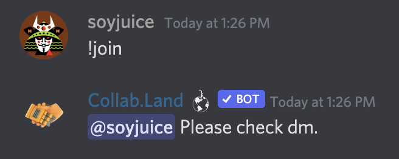
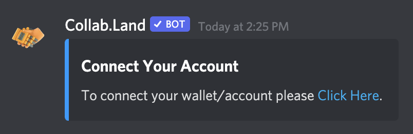
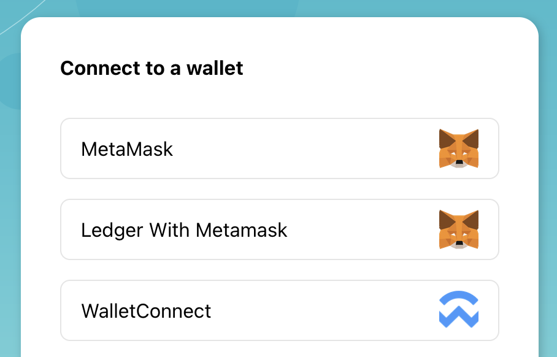
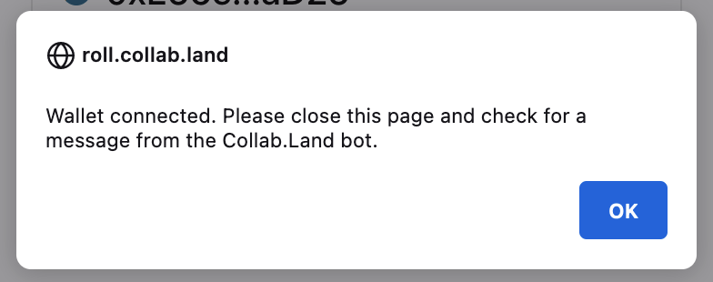
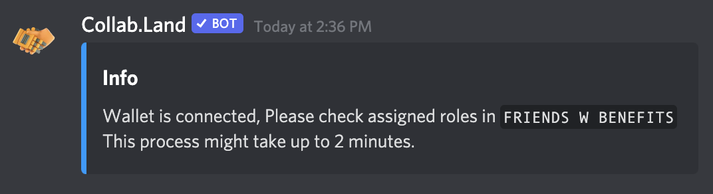

# 🤝 How to (Re)connect Your Wallet

In some cases you may want to change the wallet that you have linked to the FWB Discord.

For example , you may have upgraded your security to a hardware wallet and moved your precious $FWB to your new wallet address.

In order to keep access to the FWB Discord you connect your new wallet. FWB uses a tool called CollabLand to connect Discord user names with wallet addresses.

This guide explains how to update your linked wallet address using the CollabLand bot in Discord.

### 1. Have Your New Wallet Ready

Make sure your new wallet contains at least 75 $FWB and that you have it ready to sign a transaction.

### 2. Request the Re-Connect

Navigate to the [#🔗wallet-connect](https://discord.com/channels/749418486874243212/827381098434396180/) channel in the FWB Discord.

Type `join!` in the channel and press enter.

The Collab.Land Discord bot will immediately ask you to check your DMs.

Click the _Click here_ link and click _Yep!_ button when Discord asks you to confirm navigating to an external page.

### 3. Connect Your New Wallet

On the Collab.Land website you will now be asked to connect a wallet.

Select your preferred method to connect your new wallet.

In this guide we will use MetaMask. The MetaMask dialog pops up and asks to Sign the request.

Check if you connected the correct wallet.

Click _Sign and c_onfirm the transaction on your hardware device if you use one.

### 4. Confirmation

The Collab.Land website now returns a confirmation dialog.

Navigate to Discord and check for a new DM from Callob.Land.

🎉 You have now successfully connected a new wallet to the FWB Discord.

### Additional Resources




