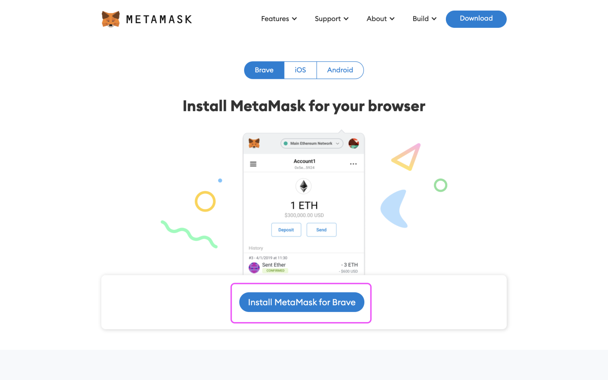

# 💳 How To Set Up Your First Ethereum Wallet

Hello and welcome to the exciting world of Web 3. We're thrilled to have you join FWB. Once your application has been approved, you will need to purchase at least 75 $FWB tokens to get full access to the Friends with Benefits Discord server. To get started, the first thing you will need is an Ethereum wallet to store these tokens.

## Background — What Are Wallets?

Before we create your wallet, it's helpful for your security to understand the basics of how a wallet works.



An Ethereum wallet houses your account information in the Web3 world. These accounts can hold assets such as cryptocurrencies and NFTs. It also provides a way to connect to Web3-enabled sites and interact with applications hosted on the Ethereum network (often referred to as _dapps_).

### Difference with exchanges

If you're already using a cryptocurrency exchange (like Coinbase, Gemini, Kraken, Binance, FTX, etc.), you might be familiar with holding crypto assets. But, you likely aren't familiar with connecting to applications. This is because exchanges are _custodial_ accounts. Cryptocurrency exchanges keep track of your cryptographic secrets, and you rely on them to keep your secrets safe. These exchanges don't allow you to take ownership of your actual Ethereum account details, which means you don't actually know your Ethereum address, and can't go out and interact with Web3 applications.

### Why you need a wallet

Setting up your own wallet is necessary to be able to join the FWB community, since your membership is tied to your Ethereum account address. Obtaining $FWB tokens involves interacting with Uniswap, an application hosted on the Ethereum network that allows users to swap cryptocurrencies. When you set up a wallet, your assets associated with that address are truly owned and controlled by you. Since you now hold the keys to your wallet, it is also _your responsibility_ to keep them safe.



When you create a wallet, three things will be generated:

### **1. Seed phrase**

* Also known as _"secret backup phrase", "recovery phrase"_
* 12 to 24 simple words that represent a **CORE SECRET**, used to generate all of your private keys
* If anyone gains access to this, _all_ associated accounts become vulnerable.
* It's critically important that these words remain secret and stored offline, ideally in a secure _hardware wallet_ (see "choosing a wallet" below)

### **2. Private key**

* The secret key used to secure a single account
* Allows you to spend and send your crypto assets
* Must remain secret
* One wallet can hold multiple private keys, and can represent multiple accounts (all derived from the **seed phrase**)
* Anyone with the private key gains control over the crypto assets associated with that account.

### **3. Public address**

* A short, unique address used to receive transactions
* Can be shared with others
* Anyone with your public address can see your assets and transactions, but they can't control them
* One wallet can hold multiple public addresses, (each derived from its associated **private key**).
* A public address looks like this: _0x35bd01fc9d6d5d81ca9e055db88dc49aa2c699a8_



## Part I — **Choosing a Wallet**

There is a growing list of wallets to choose from. Each wallet has different features, most of them share basic features such as easy access to Dapps and DeFi. Some wallets let you purchase crypto with a credit card, swap tokens, and withdraw crypto directly to your bank without going through an exchange. Choose a wallet that best suits your needs. You can always switch wallets or make a new one later on.

Here are some popular wallets that let you explore Dapps and access DeFi:



**Browser plugin and Dapp browser**

Available on **** .png>).png>).png>).png>).png>)

Features

* Buy ETH with card
* Access DeFi
* Explore Dapps
* Swap Tokens
* High Volume Transactions



**A fun and simple mobile wallet**

Available on **** .png>)

Features

* Buy ETH with card
* Access DeFi
* Explore Dapps
* Swap Tokens



**A mobile wallet and Dapp browser**

Available on **** .png>).png>).png>).png>)

Features

* Access DeFi
* Explore Dapps



**Browser plugin and Dapp browser**

Available on **** .png>).png>).png>).png>).png>)

Features

* Buy ETH with card
* Withdraw crypto to bank
* Access DeFi
* Explore Dapps
* Swap Tokens
* Multi-sig protection



## Part II — **Setting Up Your Wallet**

Once you've decided which wallet you want to use, it's time to set it up. It should only take a few minutes to create your wallet. Aside from your device, you will need a pen and a piece of paper. Do this somewhere private, where no one else can see your screen.

Most wallets follow similar steps, but here's a step-by-step guide to creating a wallet on Metamask.

### **1. Go to** [**metamask.io**](http://metamask.io) **and click "download"**

****.png>)****

### **2. Install Metamask for your browser.**

Metamask is compatible on Brave browser, Firefox, and Chrome

### **3. Add the extension to your browser**

.png>)

### 4. Create wallet

After adding the extension to your browser, a new window will pop up prompting you to start the wallet creation process

.png>)

Since this is your first time setting up a wallet, select "create a wallet". Creating a wallet will generate a 12 word secret phrase.

.png>)

### 5. Password

Create a strong password with a minimum of 8 characters. You will enter this password every time you access web 3 sites/apps for the first time

****.png>)****

### 6. Secret phrase

Click the blurred box to reveal your secret phrase. Write these words on a piece of paper and do not store it electronically (not in your notes, photos, etc.). Never give anyone your secret phrase or else they will have access to all your assets.

.png>)

Confirm your secret phrase by selecting the words in the order you wrote them

.png>)

### 7. Done

Congratulations! 🎉 You now have your first non-custodial wallet

****.png>)****

For easy wallet access, select the puzzle icon on the upper right side and pin Metamask to your browser

****.png>)****
