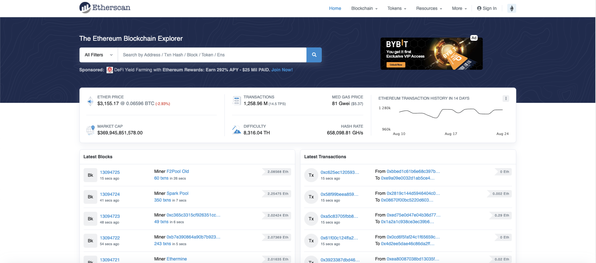
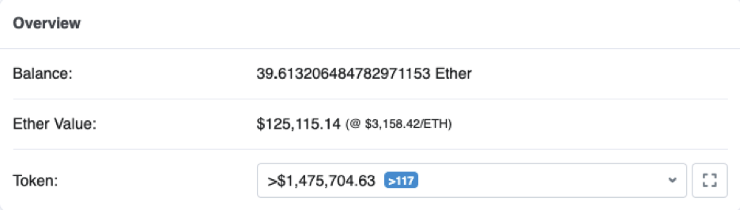
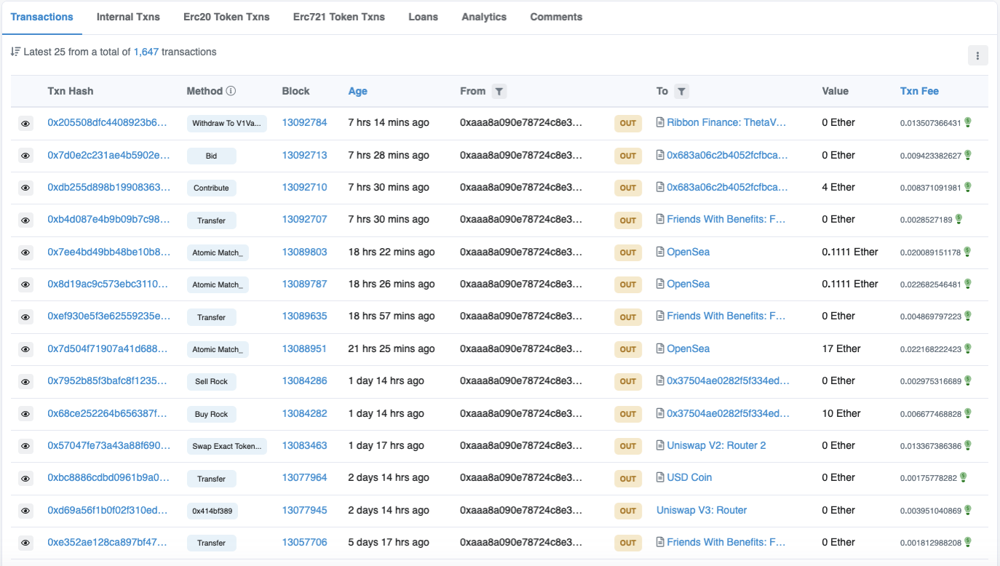
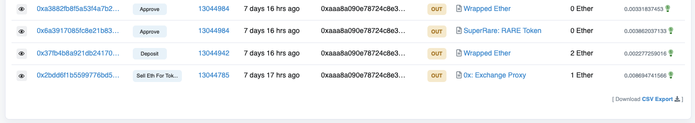
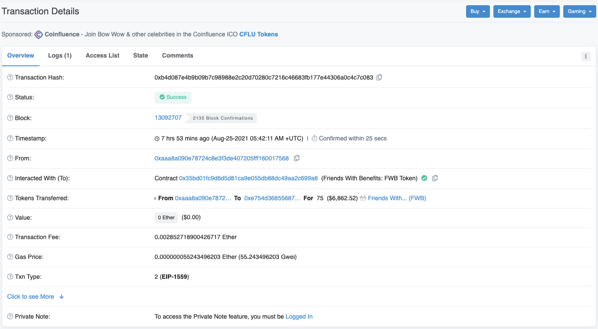
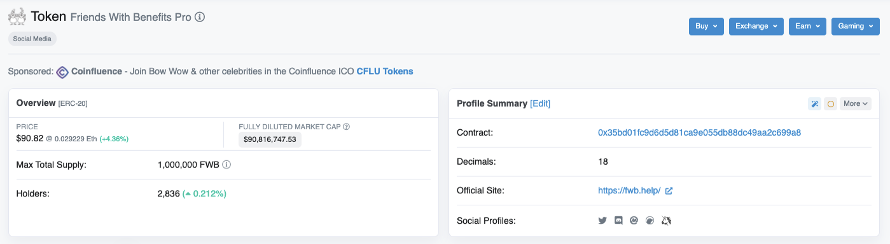
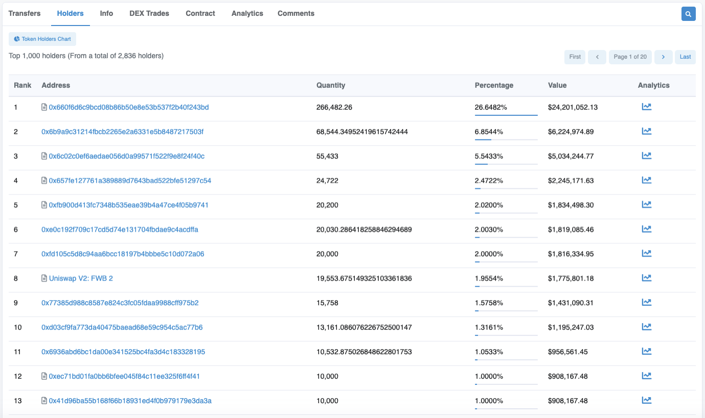

# 📊 How To Use Etherscan

### What Is Etherscan?

[Etherscan](https://etherscan.io) is a platform that lets you access information about what happens on the Ethereum blockchain. You can think of it as "Google for the world of Ethereum".

You can ask questions such as “Etherscan, show me the activity of this ethereum address 0x…” or “Etherscan, show me the details of this transaction 0x...”.

Remember, Blockchains are open ledgers so every information is public. For the Ethereum blockchain, you can access it through Etherscan.

### What Are the Different Use Cases of Etherscan?

When you arrive on Etherscan homepage, you have a main search bar where you can search for the following:

* Ethereum Addresses
* Transaction Hash
* Token

You can also search for ENS (Ethereum Name Service) addresses or Block #, but you probably won’t have much use for this in your first steps on Etherscan.

### Search for an Address

Ethereum public addresses are strings of 42 characters max that always start with “0x…”. They’re also often called “wallet addresses” because they’re used as wallet to hold cryptocurrencies (based on Ethereum here).

You can think of your ETH address as as your "bank account number: on Ethereum: you can receive and send money from it, and other people knowing about it won’t put you at risk. You can share it freely.

However, contrary to bank accounts, Blockchains are open ledgers. This means that If you give your public address to someone, they will be able to see EVERY transaction that you've ever performed using this Ethereum address. Your wallet address is safe to share, but you should only do so with people, sites, and web3 products that you trust.


<mark style="color:red;">**WARNING: There are known phishing attacks that can empty your ETH wallet with as little as you signing an unknown transaction. If you don't recognize the transaction,**</mark><mark style="color:red;">** **</mark>_<mark style="color:red;">**don't sign it**</mark>_<mark style="color:red;">**.**</mark>


If you’re on the searching end however, here are a few basic information you can find once you enter an Ethereum address. Let’s say you input your own address:

In the overview section on top, you have access to Balance, Ether Value & Token.

First, **"Balance"** gives you your Ether balance, and only your Ether balance. Even if you have other tokens on this Ethereum address, they won’t be added to this balance.

Then you have the **"Ether Value"**, which gives you the $ value of your Balance. Again, this only aggregates your Ether, and nothing else.

Last, you have **"Token"**. If you have several different tokens on your address, you should have a dropdown menu, and when you click on it, you’ll see a list of all the tokens you hold, how many you hold, what the unit price for each token is, and what’s the total monetary value represented by your tokens.

It's also worth noting that EtherScan also often assigns a value of $0 to NFT holdings, so if you see this, don't freak out. If you want to get an idea of what your NFTs are worth, try [Zapper.Fi](https://zapper.fi/dashboard).

Moving down the same page, you’ll reach a location with several tabs, and right below, a list of the latest 25 transactions that were operated from this address.

Among the presented tabs, the ones that will be useful to you will be Transactions, Internal Txns, ERC-20 Token transactions and ERC-721 Token transactions.

Let’s explore those tabs and the information they display:



When the Transactions tab is on, here are the different columns you can find and that give you information about the transactions:

#### Txn Hash

That’s the ID of the transaction. If you click on it, you’ll be taken to a page that displays the details of this transaction (more on it in the Transaction Hash section below).

#### Method

No need to mind this one for now, but it basically tells you what kind of operation was performed.

#### Block

Gives you the block number of the block where your transaction was included.

#### Age

Gives you the time spent since the transaction was completed.

#### From

Gives you the Ethereum Address of the sending side of the transaction

#### To

Gives you the Ethereum Address of the receiving side of the transaction

Note that between the “From” and “To” column, you have an icon telling you if this was an “in” transaction, or “out” transaction. It’s very straightforward: a transaction originating from the Ethereum address you’re currently checking, to another address, will be marked as “out”. On the other hand, transactions coming from an external address to the Ethereum address you’re currently checking will be marked as “in”. It’s very convenient to figure out what comes in and out of a given Ethereum address.

#### Value

If the transaction includes sending or receiving Ether, the amount of Ether will be displayed. Otherwise, the default display will be 0, even if the transaction cost some Ether paid as Gas fee.

#### Txn fee

Shows the amount of Ether that was spent to process this transaction. This is the transaction fee.

Finally, note that you can download a CSV file (excel) of all your transactions with a link at the bottom of the page.




When the internal Txns tab is on, you see the list of all the internal transactions. Internal transactions are transactions that happen directly between smart contracts. This is a bit complicated so we’ll skip here, but remember if you can’t find a transaction in the main transaction list, it might be listed in the Internal Txns tab.



This tab will show you all the token transactions (not Ether, exclusively tokens) where this address was involved, either as sending side or receiving side. The display is very similar to the main Transactions tab, except that for each transaction, it’ll show you which token, and how many tokens have been transacted.



Erc721 is the code name for the token standard commonly known as NFT (Non-Fungible Token) on the Ethereum Blockchain (Be careful, not all NFTs are necessarily on the Ethereum blockchain). In this section you’ll be able to see all the transactions related to NFTs and involving this address.



### Search for a transaction hash

This is another very important feature of Etherscan. Every transaction you initiate gets assigned a transaction hash, ie a transaction ID, and this as soon as the transaction is broadcasted to the network, even if it’s not completed yet. This feature allows you to follow the status of a transaction until it gets completed and beyond. Oftentime on NFTs or DeFi platforms, you’ll initiate transactions and as soon as you do, if the platform is well designed, they’ll offer you to “view the transaction in explorer”. If you click on this link, you’ll be taken to the transaction details page and will be able to see what’s happening. Let’s dive into the type of information you can find on a transaction page.

#### Transaction Hash

This is the ID of the transaction. This is the ID you use to look for this transaction on Etherscan.

#### Status

Until your transaction is resolved, its status is "Pending". This means your transaction is “processing” or waiting to be processed.

Sometimes, when the ETH mainnet is especially busy, and gas costs are high, transactions can be stuck, sometimes for hours. This occurs because you didn’t put a high enough gas price for the transaction to go through. Note that there are ways to cancel or replace a transaction, but this is a bit advanced for now.

Once your transaction is resolved, the status is either "Success" or "Failed". If your transaction was marked a success, you should see the exchange of tokens or NFTs completed, and you should have the new digital assets in your wallet. Be careful however, when sending to exchanges or other third party platforms, there’s often a delay, as those platforms have an extra processing cushion.

Sometimes there is a short delay when receiving NFTs, for them to show up in your wallet, typically 5-20 minutes.

Often, your wallet has received the NFT or ERC-20 token and you just need to teach your wallet how to recognize it by “Adding Token”. Here, you add the smart contract address for your wallet to recognize your new token. Here's a support doc from MetaMask showing you [how to add a new token for their wallet](https://metamask.zendesk.com/hc/en-us/articles/360015489031-How-to-add-unlisted-tokens-custom-tokens-in-MetaMask).

Once you fill this information in, your tokens should be visible in your wallet.

If the status of the transaction is “Failed”, this means something went wrong with the transaction and it couldn’t be executed (oftentimes it has to do with the parameters for the transaction fees, but not only). If it fails, your wallet will give you an error message, and you’ll need to troubleshoot on your own.

#### Block

Gives you the block number on the blockchain where your transaction was included.

#### Timestamp

Gives you the exact time and date your transaction was resolved. This is very convenient to know when an event happened on the blockchain (for example, which NFT was minted first).

#### From

This gives you the ethereum address of the sender side of this transaction.

#### Interact with

This will only be visible if the transaction requires interacting with a smartcontract (ex: you want to swap tokens on uniswap, and need to interact with the uniswap smartcontract). In case you do, the smartcontract address will be listed there. It’s an important information as it allows you to make sure you interact with the right smartcontract.

#### Tokens Transferred

This will only show if the transaction you performed included tokens. This will show which token, and how many, where transferred in this transaction.

#### Value

If you didn’t send any Ether in this transaction (for example, just a token transaction), then the value here will be displayed as 0. Transaction fees are not included here either.

#### Transaction fee

That’s how much you’ve paid (in ETH) for the transaction to be processed.

### Search for Tokens

Etherscan also allows you to look up details for any given token based on the Ethereum blockchain. In the search bar, if you type a token name or a token contract address, you’ll be taken to this token’s page, where you’ll be able to check the following information:

#### Token price

Gives you an approximation of the token price

#### Fully diluted market cap

Shows the market cap for this token, based on the Max Total Supply.

#### Max Total Supply

Gives you the maximum amount that will ever exist for this token, under this smartcontract. For example in the case of FWB, the Max Total Supply is 1,000,000 FWB.

#### Holders

Gives you the number of different addresses that hold this token. Be careful though, as some people may have multiple addresses holding similar tokens. So the holders number is just a rough estimate of the amount of people holding this token into their address.

#### Transfers

Gives you the amount of transfers that were realized and that included this token.

#### Contract

Gives you the contract ID for this token’s smartcontract. Each token has its own smartcontract address. When you find a pool on a platform like uniswap or sushiswap, and you want to make sure the token you’re exchanging is the right one, checking the contract address on Etherscan is a good way to cross check and be reassured.

#### Decimals

Gives you the maximum amount of decimal to express the smallest amount denominated in this token. For example, a token with 2 decimals can go down to 0,01. Trying to send 0,001 will result in an error. Bitcoin's smallest unit is known as a “Satoshi”. It’s 0,00000001 Bitcoin (8 decimals).

If you keep scrolling down, you’ll see several tabs. One interesting thing to look at is the holders tab. It shows you the list of addresses holding this token, ranked from the one that holds the most, to the one that holds the least. It’s interesting for 2 things: You can see if the token is more or less decentralized (If you have a big amount of holders but 1 address holds 80% of the supply, this means the token is very poorly decentralized), and also you can see how some of the holders behave, and what other token they hold, by visiting their address page.

It’s now up to you to explore the world Etherscan allows you to access, and build your own habits! :)
