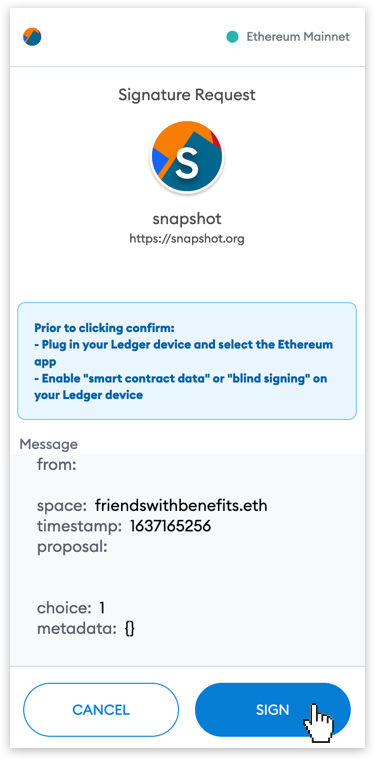

# 🗳 How To Vote on Snapshot

This guide explains how to vote on an FWB proposal that is open for voting on [Snapshot.org](http://snapshot.org). You can check out [FWB's Snapshot page here.](https://snapshot.org/#/friendswithbenefits.eth)

Decisions within FWB are made using proposals that $FWB tokenholders can vote on. Once the vote has completed, the option(s) that received the most votes or voting power is automatically selected.

Any FWB member can initiate a proposal and do so by engaging with the Proposal Review Committee. A proposal that has been refined to be voted on by the community at large is posted on [Snapshot.org](http://snapshot.org) for a vote.

FWB uses [different types of voting](https://docs.snapshot.org/proposals/voting-types) for different types of proposals. In this example we'll use the most common voting type: Single choice voting. Each voter selects a single option (e.g. Approve) and the number of $FWB in her wallet equals her voting power.

In order to vote on any proposal you will need at least [$75 FWB in your wallet](https://www.notion.so/How-To-Purchase-FWB-ff43a18ead2043a7813ef24894ee4edb).

### 1. Go to FWB's Snapshot Space

Navigate to [snapshot.org](http://snapshot.org) and search for the FWB snapshot space.

Or visit it our space directly at [snapshot.org/#/friendswithbenefits.eth](https://snapshot.org/#/friendswithbenefits.eth/).

### 2. Connect Your Wallet

Click on "Connect wallet" button in the top right corner.

Connect with a wallet where you hold at least $75 FWB.

### 3. Select the Proposal

Select the proposal that you want to vote for (if a proposal is open to receive votes the "Active" label will be displayed).

### 4. Read the Proposal

The description of the proposal contains a summary of the proposal's background, the authors, and a description of each voting option.

More information, such as financials, can usually be found by clicking the relevant links in the description text.

### 5. Select your Option(s)

Sign the message via your wallet and done.

Confirm your vote.

### 4. Sign the Message

Sign the message via your wallet.

🎉 You have now successfully voted on a Friends With Benefits snapshot proposal.

### Additional Resources


